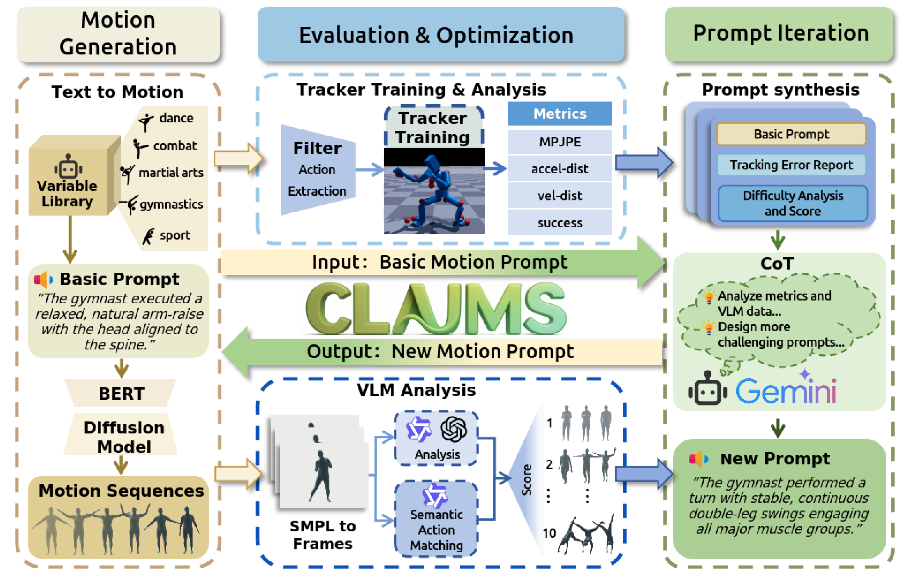

# CLAIMS

Official code release for the CVPR 2026 paper:

**Iterative Closed-Loop Motion Synthesis for Scaling the Capabilities of Humanoid Control**

Project page: [wesleyxu224.github.io/CLAIMS](https://wesleyxu224.github.io/CLAIMS/)  
Paper: [arXiv:2602.21599](https://arxiv.org/abs/2602.21599)



## Overview

CLAIMS is an iterative pipeline for humanoid robot learning:

1. generate text prompts
2. generate motions from prompts
3. convert motions into controller-readable training data
4. train or evaluate a humanoid controller
5. render motion videos
6. obtain multimodal feedback from VLMs and PHC tracking metrics
7. synthesize the next loop of harder prompts

The cleaned release-facing workflow is documented under [CLAIMS_release/README.md](CLAIMS_release/README.md).

## Repository Structure

```text
CLAIMS/
|-- CLAIMS_release/
|   |-- README.md
|   |-- docs/
|   |-- scripts/
|   `-- vlm-feedback/
|-- prompt-generate/
|-- motion-generate/
|-- motion-convert/
|-- PHC/
|-- CVPR26_CLAIMS.pdf
`-- CVPR26_CLAIMS_Supplementary.pdf
```

Canonical components:

- `CLAIMS_release/`: release-facing entrypoint and pipeline documentation.
- `prompt-generate/`: loop0 and next-loop prompt generation.
- `motion-generate/`: text-to-motion generation and HIK conversion helpers.
- `motion-convert/`: standalone motion conversion utilities.
- `PHC/`: controller training, evaluation, and AMASS export.

## Quick Start

Start from the release workspace:

```bash
cd CLAIMS_release
python scripts/generate_initial_prompts.py --count 40 --seed 7
```

Then follow the full pipeline in [CLAIMS_release/README.md](CLAIMS_release/README.md).

## Quick Start With Released Checkpoints

Released PHC checkpoints and evaluation datasets are available on Hugging Face:

- `https://huggingface.co/Jimmy061/claims_phc`

The Hugging Face release includes:

- CLAIMS PHC checkpoints from `L0` to `L6`
- the baseline PHC checkpoint used for comparison
- four released evaluation datasets in `pkl` format

If you want to directly evaluate a released checkpoint without rerunning the full closed-loop pipeline, download one checkpoint and one evaluation dataset from the Hugging Face release, then run:

```bash
cd CLAIMS_release/PHC
CUDA_VISIBLE_DEVICES=0 python phc/run_hydra.py \
  learning=im_big \
  exp_name=claims_eval \
  env=env_im \
  robot=smpl_humanoid \
  env.motion_file=<eval_dataset.pkl> \
  env.num_envs=<num_motions> \
  test=True \
  epoch=-1 \
  im_eval=True \
  headless=True \
  no_log=True \
  checkpoint=<checkpoint.pth>
```

This is the fastest way to reproduce inference-time tracking results from the released CLAIMS controller checkpoints.

## Included And Excluded Assets

This repository is intended to release code, scripts, and documentation. It does not bundle large or restricted runtime assets by default, including:

- pretrained checkpoints
- SMPL / SMPL-X assets
- Isaac Gym assets not already licensed for redistribution
- generated motions, videos, and evaluation outputs
- private API credentials

## Models And Evaluation Data

External PHC checkpoints and evaluation datasets are released separately on Hugging Face:

- `https://huggingface.co/Jimmy061/claims_phc`

This asset repository includes:

- CLAIMS PHC checkpoints from `L0` to `L6`
- the baseline PHC checkpoint used for comparison
- four PHC evaluation datasets in `pkl` format

## Citation

If you use this repository, please cite:

```bibtex
@inproceedings{xu2026iterative,
  title={Iterative Closed-Loop Motion Synthesis for Scaling the Capabilities of Humanoid Control},
  author={Xu, Weisheng and Wu, Qiwei and Zhang, Jiaxi and Tan, Jing and Li, Yangfan and Fang, Yuetong and Xiong, Jiaqi and Wu, Kai and Ou, Rong and Xu, Renjing},
  booktitle={Proceedings of the IEEE/CVF Conference on Computer Vision and Pattern Recognition},
  pages={16398--16407},
  year={2026}
}
```

Machine-readable citation metadata is provided in [CITATION.cff](CITATION.cff).

## Contributing

Contribution guidelines are in [CONTRIBUTING.md](CONTRIBUTING.md).

## License

This repository is released under the [MIT License](LICENSE).

Note that bundled or adapted third-party components may still carry their own licenses and attribution requirements.
